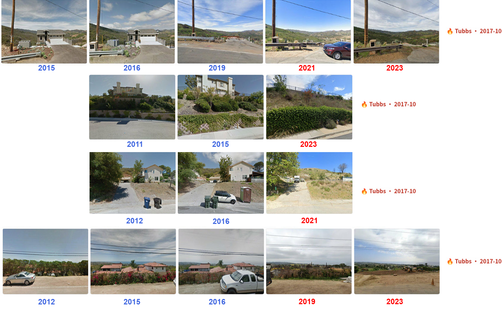
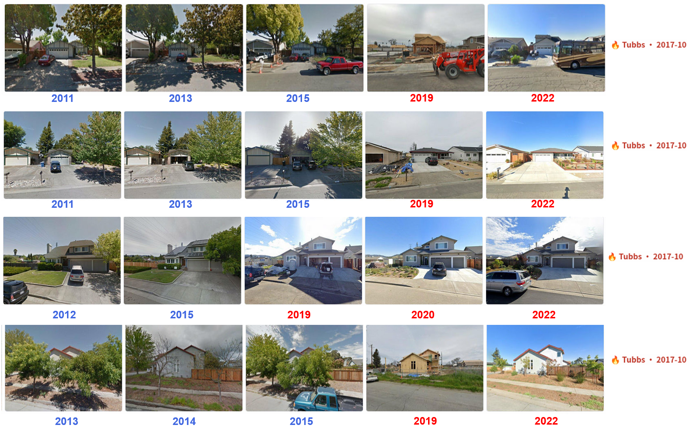
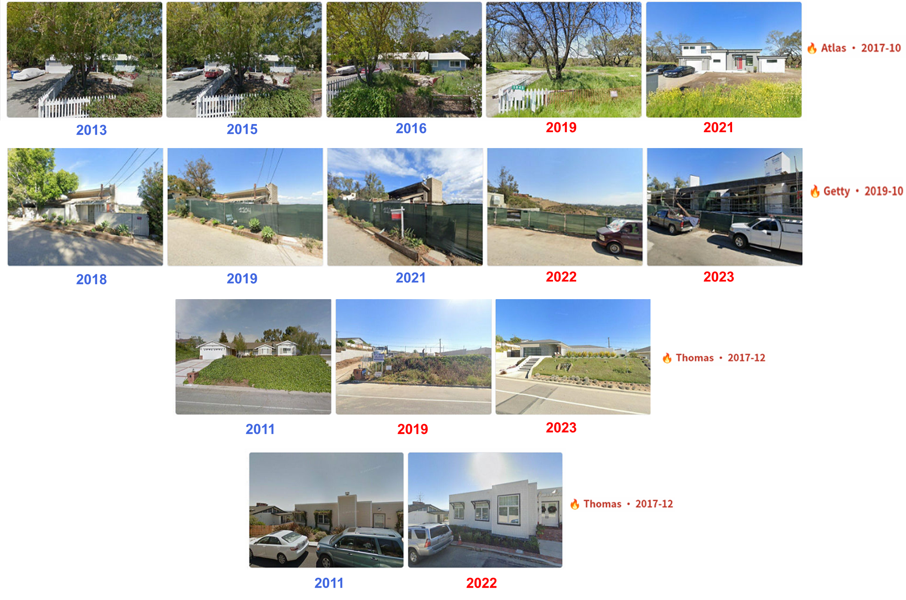
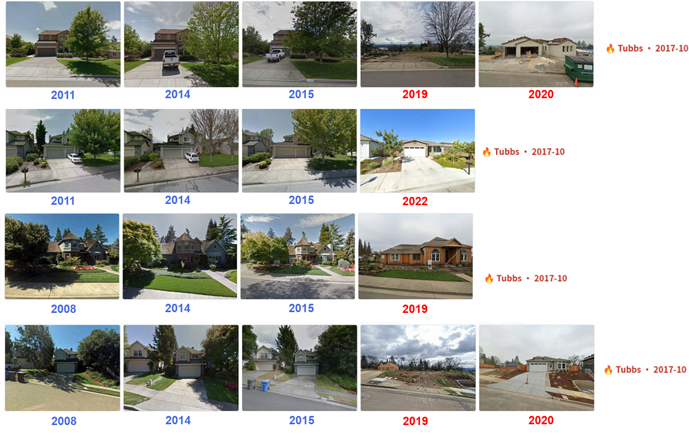
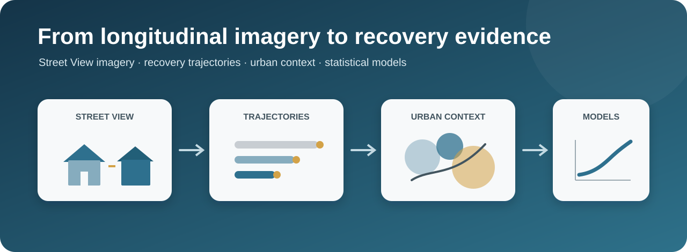
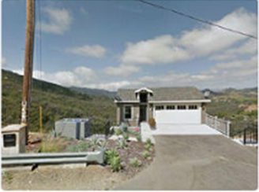
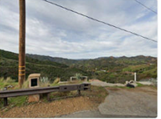

# post-wildfire-housing-recovering

> A scalable building-level observatory of how communities rebuild after wildfire.

Code accompanying the study *Unequal post-wildfire housing recovery follows income and insurance gradients*.

**Collaborating institutions:** National University of Singapore (NUS), Massachusetts Institute of Technology (MIT), Southeast University, Texas Tech University, Chongqing University, and Tongji University.

Wildfire recovery is often measured through aggregate losses or reconstruction totals. These measures can obscure where housing remains absent, where rebuilding changes the built environment, and which communities regain functioning housing most readily. This project transforms longitudinal Street View imagery into building-level recovery trajectories and connects visible reconstruction and vegetation change with neighborhood socioeconomic, environmental, credit, assistance, and insurance conditions.

The workflow is designed to reveal where recovery stalls, how rebuilding pathways diverge across communities, and which institutional conditions are associated with unequal recovery. By making these differences measurable at building and neighborhood scales, the project supports more targeted, risk-appropriate, and equitable post-disaster recovery planning.

## Longitudinal recovery examples

The longitudinal image sequences below illustrate the visible recovery outcomes represented in the workflow.

<table>
  <tr>
    <td width="50%" valign="top"><strong>Empty lot</strong><br></td>
    <td width="50%" valign="top"><strong>Rebuilt equal</strong><br></td>
  </tr>
  <tr>
    <td width="50%" valign="top"><strong>Rebuilt improved</strong><br></td>
    <td width="50%" valign="top"><strong>Rebuilt degraded</strong><br></td>
  </tr>
</table>

## Workflow

<p align="center">
  
</p>

The repository contains four focused analysis modules:

1. retrieve an authorized Street View image from a panorama reference;
2. classify the visible recovery trajectory from chronological images;
3. measure streetscape vegetation with semantic segmentation; and
4. estimate the rebuilding, upgrading and insurance-policy models used in the analysis.

## Repository structure

```text
wildfire-housing-recovery/
├── assets/
├── code/
│   ├── statistical_models.py
│   ├── streetview_api_example.py
│   ├── trajectory_classification_example.py
│   └── vegetation_measurement.py
├── examples/
│   ├── streetview_input_template.csv
│   ├── streetview_pre_fire.png
│   ├── streetview_post_fire.png
│   └── streetview_expected_output.json
├── environment.yml
└── README.md
```

## Installation

```bash
conda env create -f environment.yml
conda activate wildfire-housing-recovery
```

## Usage

### Retrieve a Street View image

Supply a panorama reference obtained through your own authorized query.

```bash
export GOOGLE_MAPS_API_KEY="YOUR_KEY"
python code/streetview_api_example.py \
  --panoid PANO_ID_FROM_YOUR_OWN_QUERY \
  --heading 180 \
  --output local_data/example.jpg
```

### Classify a recovery trajectory

Pass two to eight chronological images of the same building. The script returns the trajectory, a confidence value and a brief visual rationale.

```bash
export ANTHROPIC_API_KEY="YOUR_KEY"
python code/trajectory_classification_example.py \
  --images local_data/pre.jpg local_data/post.jpg \
  --model claude-opus-4-7
```

### Run the minimal Street View test

The repository includes one real pre- and post-fire image pair from the
longitudinal examples above. It provides a minimal input for checking the
classification interface.

<table>
  <tr>
    <td width="50%" valign="top"><strong>Pre-fire (2016)</strong><br></td>
    <td width="50%" valign="top"><strong>Post-fire (2023)</strong><br></td>
  </tr>
</table>

Run:

```bash
python code/trajectory_classification_example.py \
  --images examples/streetview_pre_fire.png examples/streetview_post_fire.png \
  --model claude-opus-4-7
```

The expected trajectory is `empty_lot`; confidence and explanatory text may vary
between API responses. The expected output schema is recorded in
`examples/streetview_expected_output.json`.

Street View imagery: © Google. Displayed here as a research example and subject
to the Google Maps Platform Terms of Service.

### Measure vegetation change

The primary workflow measures vegetation in every valid image and summarizes each building by the median pre-fire and post-fire fractions.

```bash
python code/vegetation_measurement.py \
  --pre-images local_data/pre_1.jpg local_data/pre_2.jpg \
  --post-images local_data/post_1.jpg local_data/post_2.jpg
```

### Estimate the statistical models

Run the baseline rebuilding model, the upgrading model and the joint policy model on a prepared building-level table.

```bash
python code/statistical_models.py \
  --data local_data/analysis_data.parquet \
  --output outputs
```

The prepared table must contain a unique fire identifier (`fire_id`), state FIPS code, one of the five documented trajectory labels, the seven baseline covariates, and the policy fields named in `code/statistical_models.py`. Both CSV and Parquet inputs are supported.

On Windows PowerShell, set API keys with `$env:GOOGLE_MAPS_API_KEY="YOUR_KEY"` and `$env:ANTHROPIC_API_KEY="YOUR_KEY"`.

## Input data

The scripts operate on locally supplied imagery and prepared analytical tables. Street View imagery must be accessed through the Google Maps Platform and used in accordance with the applicable terms. API credentials should be stored as environment variables and should never be committed to the repository.

## Project team

[City Syntax](https://github.com/City-Syntax)
